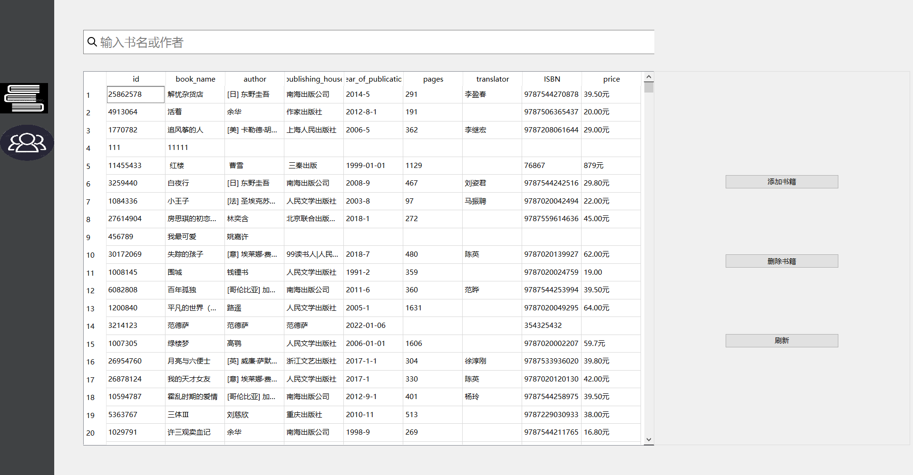
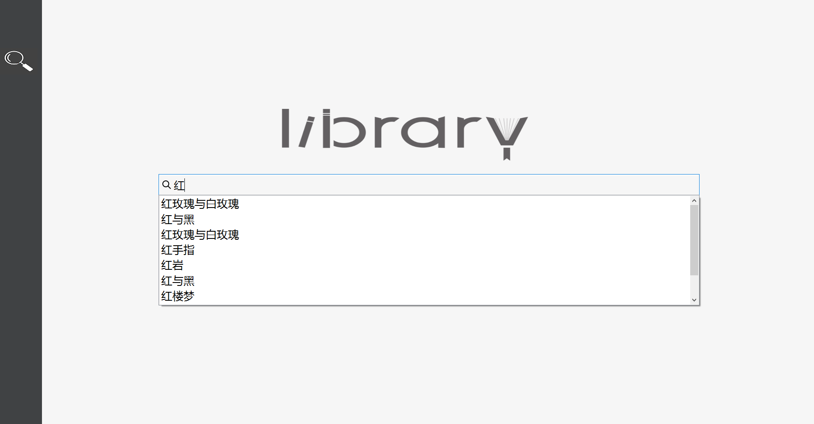
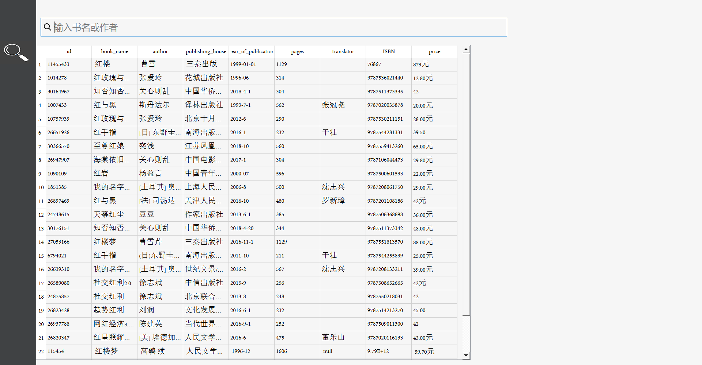
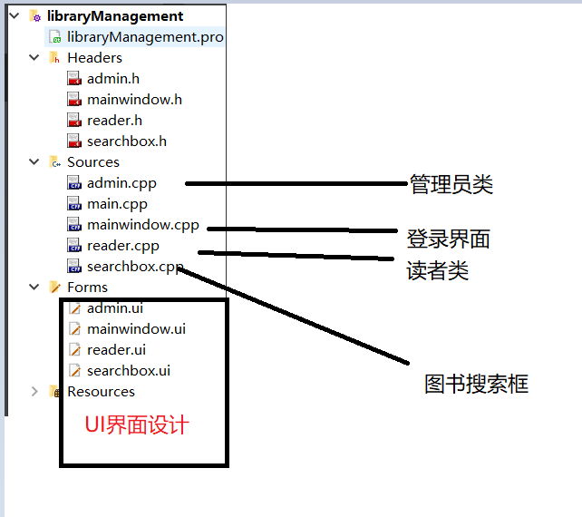

# 项目介绍

基于Qt和MySQL实现的图书管理系统

##          项目效果图

### 管理员界面

#### 图书管理

#### 用户管理

### 

### 用户界面

#### 图书搜索

#### 搜索结果

## 主要功能

1.图书的增删改查

2.管理员可对用户进行管理

3.搜索框自动提示文字

## 代码说明

## 项目部署

1.安装Qt

2.安装MySQL驱动,参考https://github.com/thecodemonkey86/qt_mysql_driver

3.在mysql中新建数据库librarymanagement,然后运行"SQL语句"文件夹中的library.sql

4.打开项目(双击librarymanagement.pro)

5.在mainwindow.cpp中修改数据库ip地址,账号,密码

6.运行(管理默认账号:admin 密码:admin         用户默认账号:20201001 密码:111111)
